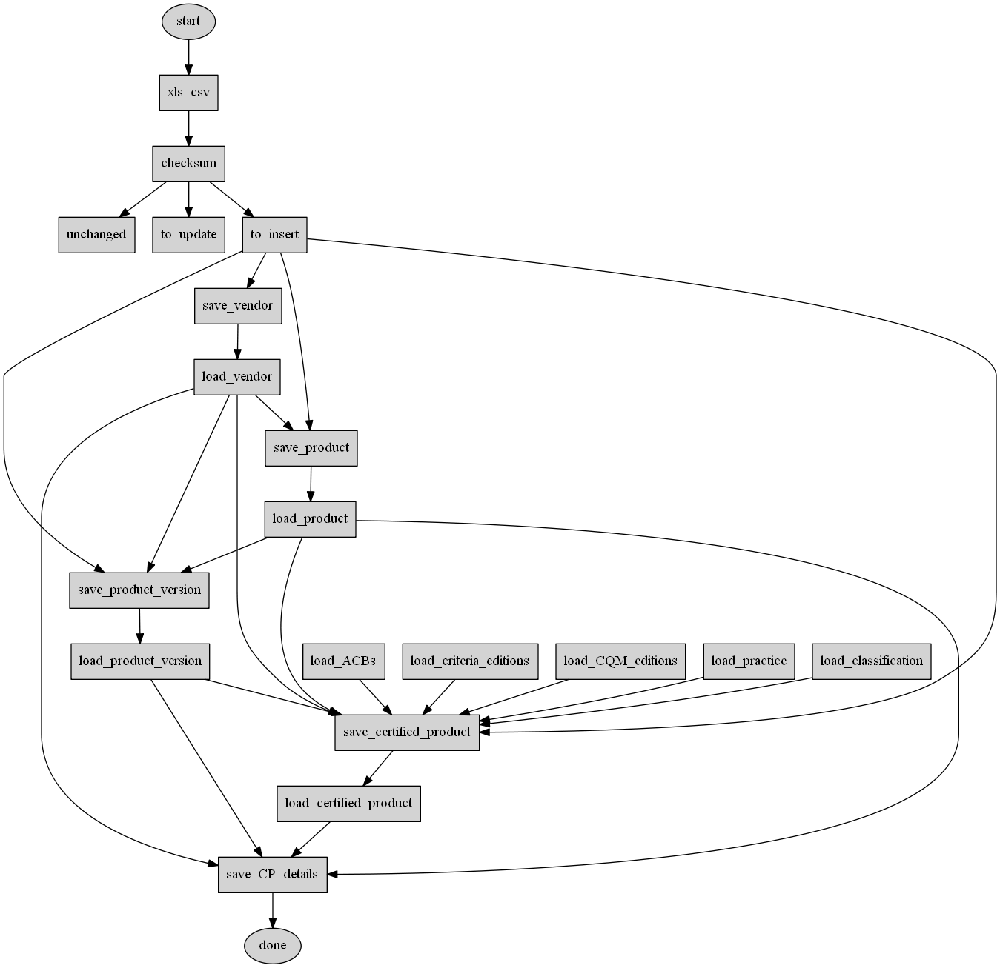
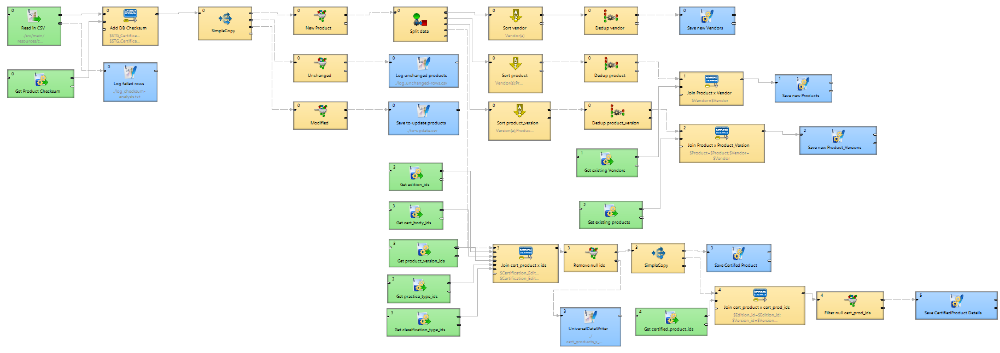

[](http://54.213.57.151:9090/job/andlar_chpl-api_chpl-etl)

# Extract, Transform, Load Component of OpenDataCHPL

This ETL extracts the current CHPL data from a provided Excel file, transforms it as necessary to fit the OpenDataCHPL data model, and loads that data into a PostgreSQL database.

The process diagram is such: 

# Installation

## Getting the code

```sh
$ git clone https://github.com/andlar/chpl-api.git
$ cd chpl-api/chpl/chpl-etl
```

## Data model load

Before running the ETL, please see [the Open Data CHPL data model README](../../openchpl-sql/README.md).

## Installing on Linux

If installing on a Linux machine, some modifications are needed. In the files:
 - `parse.sh`
 - `linux_deploy.sh`

Remove the line: `(set -o igncr) 2>/dev/null && set -o igncr; # this comment is required to trick cygwin into dealing with windows vs. linux EOL characters`

Next, run the script `linux_deploy.sh`. This script will modify the strings used as recordDelimiters in the CloverETL graphs from the Windows specific `\r\n` to the Linux `\n`.

## ETL

Edit the parameters-template.prm file to fill in the JDBC database connection URL, username, and password for your database, and rename it to `parameters.prm`. The username and password in the newly created `parameters.prm` file much match the username/role and password from the `openchpl-role.sql` file referenced in the previous section.

```sh
$ vi parameters-template.prm
$ mv parameters-template.prm parameters.prm
$ mvn package
```

# Running the ETL

```sh
$ cd chpl-api/chpl/chpl-etl
$ java -jar target/chpl-etl-0.0.1-SNAPSHOT-jar-with-dependencies.jar 'excel-file' 'plugins-directory'
```

The default parameters are:
 - Excel file: `./src/main/resources/chpl-large.xlsx`
 - Plugins directory: `./src/main/resources/plugins`

## Search a directory

A batch parsing script is available in `parse-template.sh`. The script should be renamed to `parse.sh`, and will need to be modified to set user-specific configurations:
 - "To" email address(es)
 - "From" email address
 - SMTP settings
 - SMTP user name
 - SMTP password

This script will look in the directory `./input` for any files ending in `.xlsx`, and run those files through the ETL, then move the files that were processed into `./input/parsed/input`, along with a timestamped log file that captures the output of the parsing activity, as well as the specific `to-update.csv` file that was generated during that run.

# CloverETL

This ETL makes use of the CloverETL engine. The first few steps of this process are outside of the CloverETL engine. This includes a conversion from the provided .xlsx files to a version of a .csv, where the actual separating character is a `^`, in order to avoid running into issues with commas in the data. That conversion also includes a step where a hash of each row of the data file is appended to that row, in order to track if the data in the row changes at some point in the future.

After the conversion and appending of the hash, the CloverETL engine picks up the outputted .csv and processes it. A graphical view of that process is here: 
